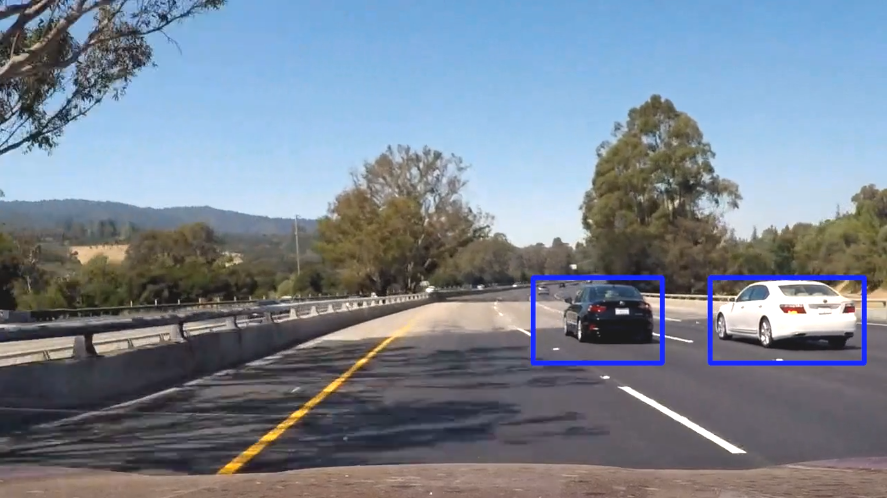

# Project: Tracking Vehicles on the Road 

# Project Description

When we drive, the decisions we make often rely on the position of the other road users. For some of them, like taking over or braking, it is vital to have a precise idea of the position of the other vehicles.  Naturally, one of the first things we would like to do in developing a self-driving car is to automatically detect the positions of the other vehicles, and the volume they occupy on the road.
In this project I will detect vehicles on the road on images and a video using classic computer vision and machine learning techniques.
The provided dataset consists of road recordings where the vehicles are visible, and the goal is to surround the position of the vehicles on the lane using fitting bounding boxes. I built the image processing pipeline myself and applied it to the given images and test videos.

The requirements for this project can be found in the [CarND Term1 Starter Kit](https://github.com/udacity/CarND-Term1-Starter-Kit/blob/master/README.md).

# Project Pathway

To understand the pipeline I implemented, follow the notebook "Vehicle Detection and Tracking.ipynb". 
To extract meaningful information from the give images, I first started by implementing several feature extraction techniques.
After combining all those techniques to extract a global feature vector for the image, I trained a simple Support Vector Machine on templates of vehicles and non-vehicles, having processed these images through my feature extraction pipeline.
I then implemented a naive sliding window technique to swipe the complete image of the road and compute all possible windows.

The next step was to extract image patch corresponding to each window and feed it to the classifier to check for a vehicle or not.

Once this process was complete, I could review the sliding window algorithm to make it more efficient. Indeed, instead of extracting the patches one by one and computing the feature vector for every patch, I implemented a function that computes the features for the entire image, and then for every patch extract the corresponding part from the global feature vector. After this step, I could start applying the pipeline to different test images pulled from the video.

As seen above, some outliers remained. I used a heatmap technique to discard outliers. The idea is to assign values to the pixels depending on the number of bounding boxes they lie in. Then, by selecting the correct threshold I can recover the pixels that are most probably part of a car. I can then test the entire pipeline on the test video. Here is the result:

The result is not great. We obtain a rather "chaotic" succession of windows, because they change a lot every frame. To remedy this issue and obtain something better, I implemented a sliding window method that "smoothes" (averages) windows over time, to obtain something more "stable". We obtain the following result:

# Conclusion

In this project, I was able to build a pipeline that computes bounding boxes surrounding the vehicles on the road using the provided videos. On simple scenarios, the pipeline is quite robust: indeed, I implemented a method to interpolate windows across frames, which allows for an increased robustness. However, there are some improvement points:
1. First, the performance begins to drop when lighting conditions are changing a lot (lots of sunlight or shades), which is one point of improvement. This comes from different parts of the pipeline, but is mostly due to the classifier. Indeed, the training dataset does not contain a lot of variations in terms of lighting conditions, thus, the classifier performs poorly when there is less lighting, or way more. To remedy this issue, I would have to increase the size of the training dataset, or change the feature extraction process to make it less sensitive to lighting.
2. Similarly, the color of the road impacts the performance of the classifier, which is a real problem since there are many different colors for a road. Again, increasing the size of the templates dataset would help remedy that issue. I am not mentionning deep learning here because the idea is to only use classic computer vision/machine learning techniques.
3. Finally, increasing the number of different scaling factors applied to the image before processing it could help make the whole pipeline more robust and obtain more adequate bounding boxes. Indeed, I am for now dividing each frame into three different regions, and apply three different scalings to each region (depending on what I assume the size of the car would be on that region of the road), then add the union of all the computed bounding boxes on the resulting heatmap. Increasing the number of scaling factors could help with the accuracy of the bounding boxes, but would slow down the process. 

# References

This project is provided within Udacity Self driving Car Engineer Nanodegree program. All the details are available on the [Udacity Github Repository](https://github.com/udacity/CarND-Vehicle-Detection), and on the [Udacity website](https://www.udacity.com/course/self-driving-car-engineer-nanodegree--nd0013) related to the course.

The images used for the training of the classifier come from a combination of the [GTI vehicle image database](http://www.gti.ssr.upm.es/data/Vehicle_database.html), the [KITTI vision benchmark suite](http://www.cvlibs.net/datasets/kitti/), and examples extracted from the project video itself.
